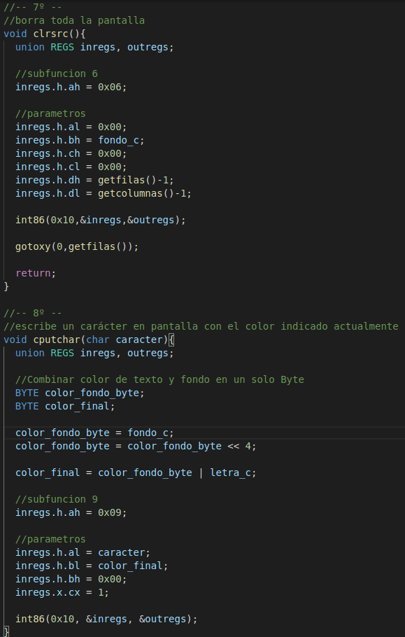
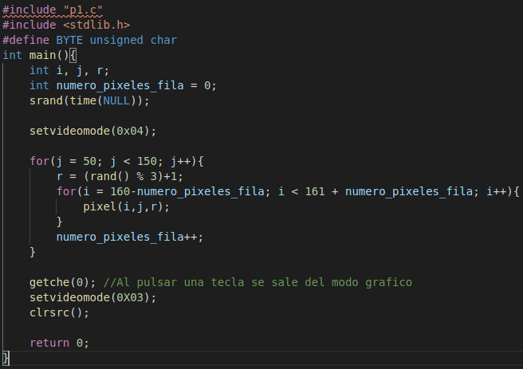

# PRÁCTICA 1

## Realizada por [Irene Muñoz Domingo](https://github.com/irenchuchu) y [Juan Carlos Pineda Muñoz](https://github.com/juancpineda97)

### Requisitos mínimos
Para cubrir los requisitos mínimos de esta práctica, hemos implementado las 9 funciones que se indican en el guión, las cuáles se encuentran en el archivo [p1.c](codigo/p1.c), el cuál se podría incluir en cualquier otro archivo de C para usar sus funciones. Las funciones son las siguientes:

Además, hemos implementado el archivo [main.c](codigo/main.c), el cuál contiene un `main` que prueba algunas de las funciones implementadas:

### Ejercicio Opcional 1
Se ha realizado el ejercicio opcional 1 implementando la siguiente función que dibujará un recuadro en la pantalla en modo texto con los parámetros de las coordenadas del recuadro, el color de primer plano y
el color de fondo.

### Ejercicio Opcional 2
También se ha realizado el ejercicio opcional 2, en el que hemos implementado en el archivo [grafico.c](codigo/grafico.c) un programa en C que, estableciendo el modo gráfico VGA, crea el dibujo de un triángulo en pantalla, en el que cada fila es de un color aleatorio de entre 3 de los 4 disponibles:

El resultado de la ejecución es el siguiente:

