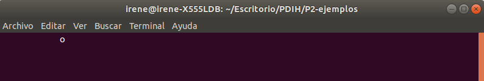

# PRÁCTICA 2

## Realizada por [Irene Muñoz Domingo](https://github.com/irenchuchu) y [Juan Carlos Pineda Muñoz](https://github.com/juancpineda97)

### Ejercicio 1: 
##### Instalación de la librería: 

##### Comrpobación de que funcionan los ejemplos propuestos: 

### Ejercicio 2: Crear un juego sencillo tipo “pong” partiendo del ejemplo del movimiento de la pelotita. Al iniciar el juego debe mostrarse un recuadro en una pantalla de bienvenida explicando los controles de juego. Tras una pausa se inicia el juego en sí mismo. 

El enlace al código es el siguiente: [pong.c](pong.c)

#### Adjuntamos algunas capturas del código:

- Primero una captura de las funciones auxiliares usadas para dibujar en pantalla:

- Luego, el bucle principal en el que se desarrolla el juego: 

- El switch que determinará la siguiente dirección de la bola:

- Después, en función de la siguiente dirección, se modificarán las coordenadas de la bola o se contabilizará el punto:

- Por último se capturará la pulsación de las teclas de movimiento, se imprimirá la bola y se esperará un tiempo para volver a ejecutar el bucle:

#### Capturas del funcionamiento del juego:

Como se observa, incrementamos el contador cada vez que se marca un punto:

