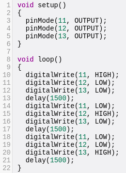
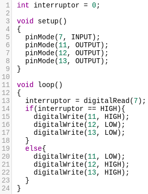
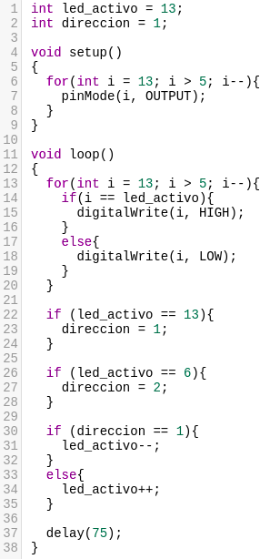

# Práctica 3

## Realizada por [Irene Muñoz Domingo](https://github.com/irenchuchu) y [Juan Carlos Pineda Muñoz](https://github.com/juancpineda97)

### Ejercicio 1
Implementar el programa de parpadeo de LED, ampliándolo para que encienda y apague alternativamente tres LEDs (uno rojo, otro amarillo y otro verde), conectados a las salidas digitales 11, 12 y 13 del Arduino, a un intervalo de 1.5 segundos.

En el siguiente GIF se puede apreciar la ejecución de este ejercicio:

Para su funcionamiento se ha usado el siguiente código, en el que primero establecemos los pines 11, 12 y 13 de salida, que irán conectados a los LEDs, y luego en el bucle principal se irá encendiendo y apagando los LEDS correspondientes a la secuencia a realizar, con su correspondiente `delay` entre medias:

### Ejercicio 2
Partir del programa de parpadeo de LEDs anterior y ampliarlo con las modificaciones necesarias para que se encienda el LED rojo solo cuando se pulse un interruptor conectado a la entrada digital 7, y en ese momento se apaguen los LEDs amarillo y verde.

En el siguiente GIF se puede apreciar la ejecución de este ejercicio:

Se ha usado el siguiente código, usando los mismos pines para los LEDs que en el ejercicio anterior y el pin 7 para el interruptor. En el bucle principal, se obtiene el estado del interruptor, y según éste estado, se encienden unos LEDs u otros:

### Ejercicio 1 - Subir nota
Secuencia de LEDs, encendiendo y apagando 4 LEDs secuencialmente, de forma similar a las lucecitas de "El coche fantástico".

En el siguiente GIF se puede apreciar la ejecución de este ejercicio:

Se ha usado el siguiente código, en él se establecen los pines del 13 al 6 para los LEDs, y, en el bucle principal, primero se apagan y encienden los LEDs correspondientes, posteriormente se comprueba si el led activo actualmente es uno de los que están en los extremos, y si es así, se cambia de dirección, y finalmente, según la dirección actual, se aumenta o disminuye el led que se encenderá en la siguiente iteración:

