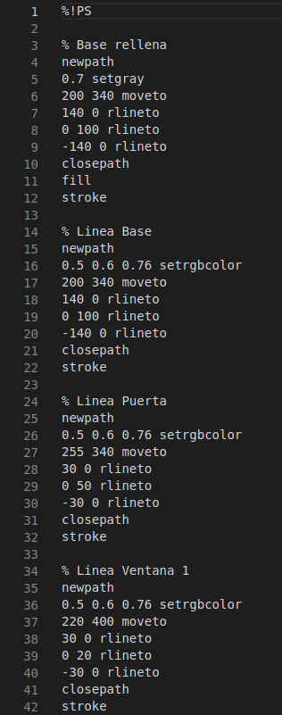

# Práctica 4

## Realizada por [Irene Muñoz Domingo](https://github.com/irenchuchu) y [Juan Carlos Pineda Muñoz](https://github.com/juancpineda97)

### Ejercicio 1: 
Página en la que se muestre el dibujo de una casita

Para realizar este ejercicio, se ha usado el código del archivo [ejercicio1.ps](archivos/ejercicio1.ps), a continuación se muestran capturas del código que genera la página resultante. Como se puede observar, se ha organizado en bloques con `newpath` para crear en cada bloque la figura correspondiente a la base de la casa, el tejado, la puerta y las ventanas, aplicando las transformaciones necesarias para crearlas en el sitio justo y con el color deseado:

La página resultante es la siguiente, además, a partir del archivo `.ps` se ha generado el siguiente [PDF](archivos/PDFejercicio1.pdf) y el siguiente [JPG](archivos/JPGejercicio1.jpg):

### Ejercicio 2:
Página en la que diseñes una tarjeta de visita

Para realizar este ejercicio, se ha usado el código del archivo [ejercicio2.ps](archivos/ejercicio2.ps), a continuación se muestran capturas del código que genera la página resultante. Como se puede observar, se ha organizado por bloques, de igual forma que en el ejercicio anterior:

Como en el apartado anterior, la página resultante es la siguiente, además, a partir del archivo `.ps` se ha generado el siguiente [PDF](archivos/PDFejercicio2.pdf) y el siguiente [JPG](archivos/JPGejercicio2.jpg):

