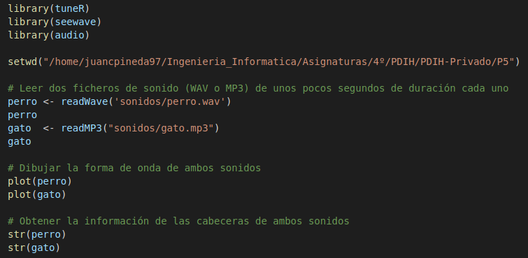
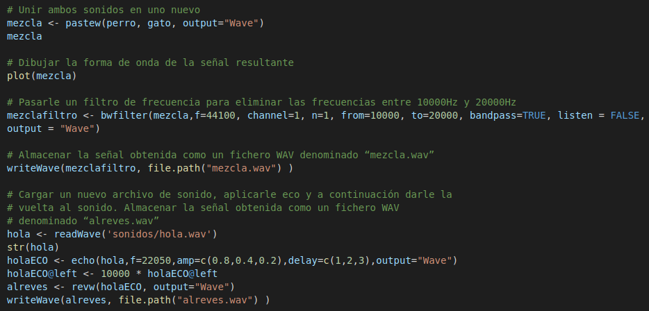
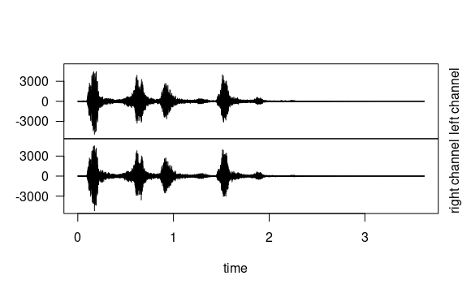
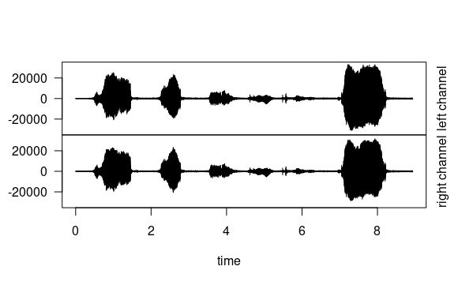
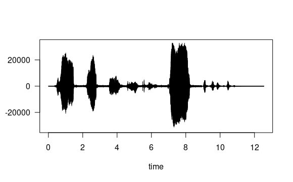

# Práctica 5

## Realizada por [Irene Muñoz Domingo](https://github.com/irenchuchu) y [Juan Carlos Pineda Muñoz](https://github.com/juancpineda97)

Para realizar esta práctica, se ha usado un [script](P5.R) en `R`, que realiza todas las funciones pedidas. El script es el siguiente:

En el script, para leer los ficheros de sonido, se ha usado la función `readWave` para leer archivos .wav y la función `readMP3` para leer archivos .mp3. Para mostrar la forma de onda de los sonidos, se ha usado la función `plot`, la cuál muestra el siguiente resultado en el archivo *perro.wav*:

Y para el archivo *gato.mp3*:

Luego, para obtener la información de las cabeceras, se ha usado la función  `str`, y, para unirlos, la función `pastew`. La forma de onda de la mezcla de *perro.wav* y *gato.mp3* es la siguiente:

Por último, para aplicar un filtro de frecuencias se ha usado la función `bwfilter`, para aplicar eco la función `eco`, y para dar la vuelta al sonido, la función `revw`. Para acabar, los nuevos sonidos se pueden guardar en archivos con la función `writeWave`.