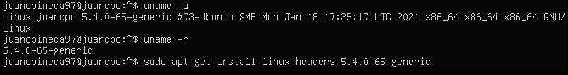
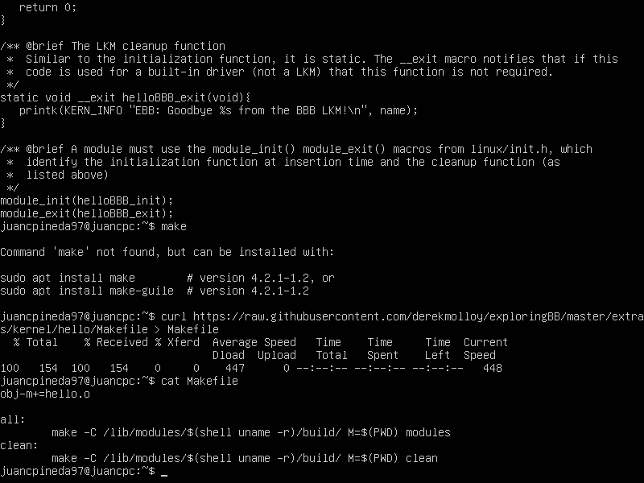
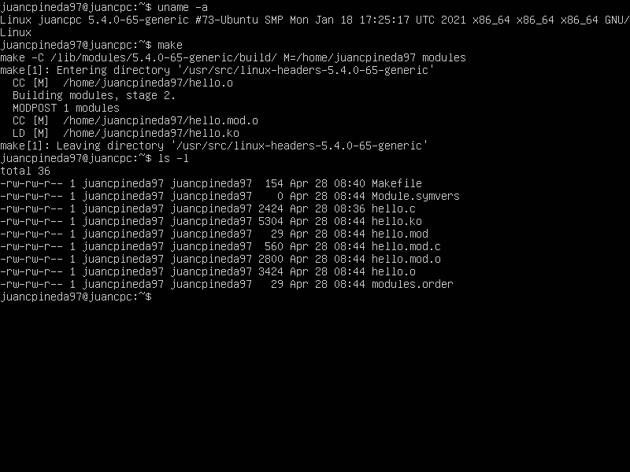
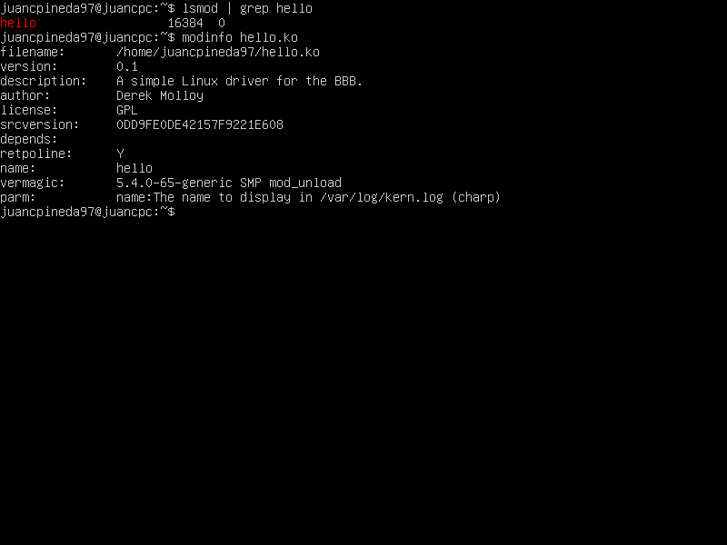
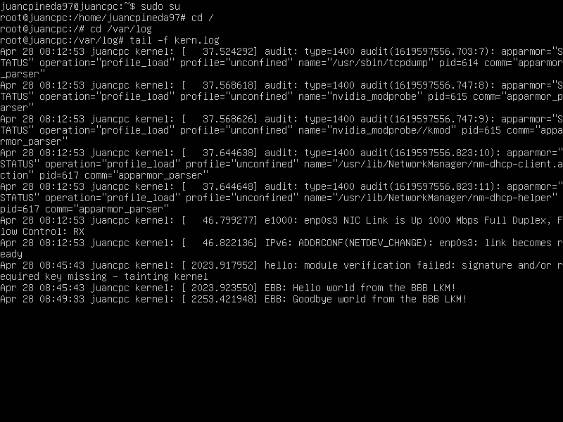

# Seminario LKM (S4)

## Realizado por [Irene Muñoz Domingo](https://github.com/irenchuchu) y [Juan Carlos Pineda Muñoz](https://github.com/juancpineda97)

Antes de probar el módulo LKM, hay que comprobar que están instaladas las cabeceras de Linux, para ello, usaremos los siguientes comandos:

```
uname -r
sudo apt-get install linux-headers-5.4.0-65-generic
```
Con el primer comando se obtiene la versión exacta del kernel linux que tenemos instalada, para, con el segundo comando, instalar las cabeceras de la versión de nuestro kernel (en nuestro caso, ya estaban instaladas). El resultado de la ejecución es el siguiente:



Luego, descargaremos el código del módulo kernel que vamos a usar, que será el módulo `hello.c` usado en el seminario, además de su correspondiente `Makefile` para compilarlo:



Y, una vez realizado esto, procedemos a compilarlo con la orden `make`, y, cómo se puede apreciar en la captura de pantalla, esto nos genera el archivo `hello.ko`, que es el propio LKM compilado:



Ahora, procedemos a cargar el nuevo módulo en el kernel con el comando `sudo insmod hello.ko`, y luego, con el comando `lsmod | grep hello` podemos ver que ya estaría cargado el nuevo módulo, y con el comando `modinfo hello.ko` podemos ver la información del nuevo módulo:



Luego, con el comando `sudo rmmod hello.ko` lo descargamos del kernel, y, por último, podemos comprobar en el log del kernel, como se aprecia en la siguiente captura, que el LKM se había cargado y descargado correctamente del kernel, ya que muestra los mensajes esperados en el log (las dos últimas entradas):

