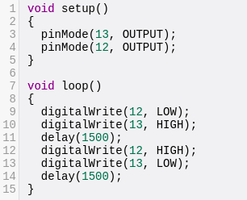
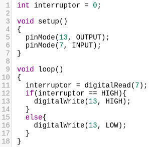

# Seminario Arduino (S3)

## Realizado por [Irene Muñoz Domingo](https://github.com/irenchuchu) y [Juan Carlos Pineda Muñoz](https://github.com/juancpineda97)

### Ejercicio 1: 
Implementar en los simuladores el programa de parpadeo de LED, ampliándolo para para que encienda y apague alternativamente dos LED (uno rojo y otro verde), conectados a las salidas digitales 12 y 13 del Arduino, a un intervalo de 1.5 segundos.

Los ejercicios se han construido en el simulador [Tinkercad](https://www.tinkercad.com).

En el siguiente GIF se puede apreciar la ejecución de este ejercicio:

Para su funcionamiento se ha usado el siguiente código:

### Ejercicio 2: 
Implementar en los simuladores el programa de parpadeo de LED, ampliándolo con las modificaciones necesarias para que se encienda el LED solo cuando se pulse un interruptor conectado a la entrada digital 7.

En el siguiente GIF se puede apreciar la ejecución de este ejercicio:

Para su funcionamiento se ha usado el siguiente código, en el que se establece primero el pin 13 como salida y el pin 7 como entrada, luego en el loop se comprueba el estado del pin conectado al interruptor, y en el caso de que esté con valor ´HIGH´ se enciende el led, y en otro caso, se apaga:

