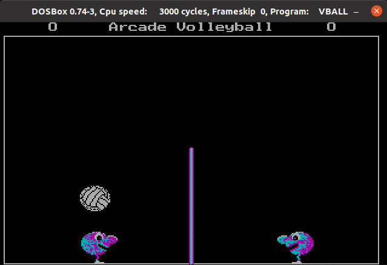
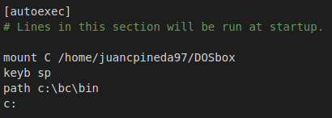
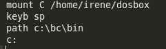
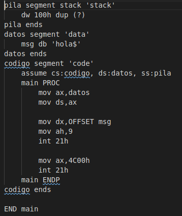
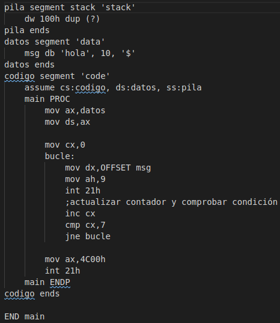
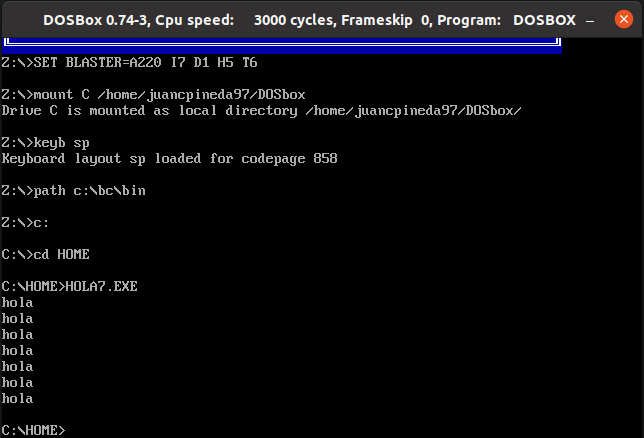

# SEMINARIO 1

## Realizado por Irene Muñoz Domingo y Juan Carlos Pineda Muñoz

### Ejercicio 1
Una vez instalado el software en Ubuntu, hemos probado a ejecutar el siguiente juego:

Y, como se puede ver, se ejecuta satisfactoriamente.

### Ejercicio 2
Para ello, hay que añadir la configuración correspondiente al archivo `~/.dosbox/dosbox-0.74.conf` , que será la siguiente:

En ella, en la primera línea monta en la unidad c: el directorio donde se encuentra el entorno de programación Borland C, luego cambia la configuración del teclado a español, añade a la variable path el directorio “bin” donde se encuentra el ejecutable BC.EXE, y por último cambia a la unidad c:.

### Ejercicio 3
Primero, hemos realizado el ejemplo "hola", con el siguiente [código](codigo/hola.asm), que imprimirá "hola" por pantalla:

Y luego, modificando este [código](codigo/hola7.asm) añadiendo un bucle, mostrará por pantalla el mensaje "hola" 7 veces:

El resultado de la ejecución es el siguiente:

